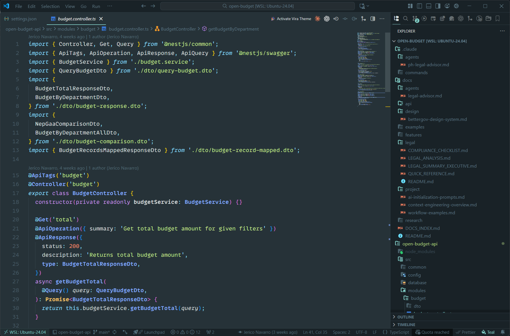
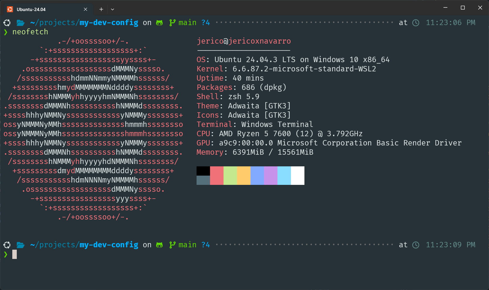
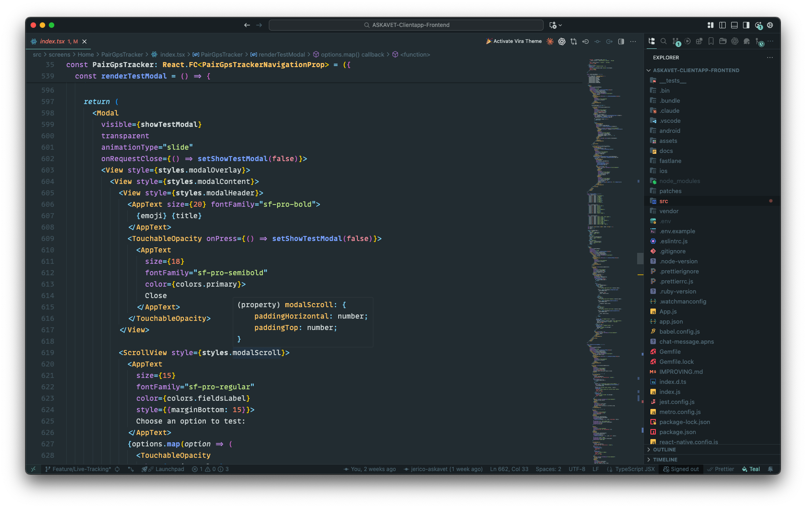
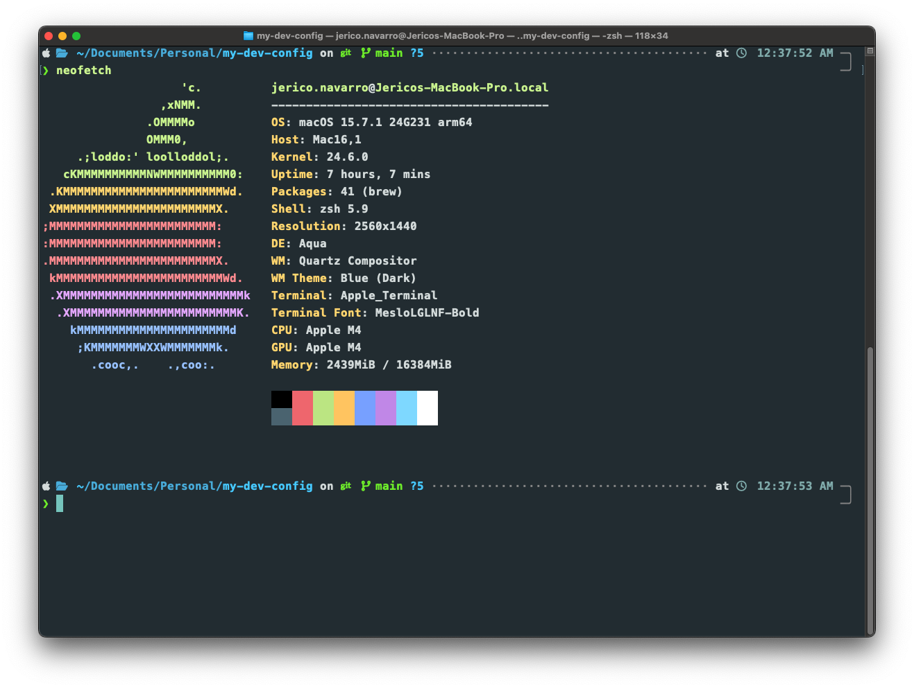

# Dev Environment Configuration

A cross-platform development environment configuration repository for **Windows** and **macOS**, featuring carefully curated VS Code settings, ZSH shell configuration with Powerlevel10k theme, and custom terminal setups.

## Table of Contents

- [Overview](#overview)
- [Features](#features)
- [Screenshots](#screenshots)
- [Repository Structure](#repository-structure)
- [Prerequisites](#prerequisites)
- [Installation](#installation)
  - [Windows/WSL Setup](#windowswsl-setup)
  - [macOS Setup](#macos-setup)
  - [Font Installation](#font-installation)
- [Configuration Details](#configuration-details)
- [Customization](#customization)
- [Technologies](#technologies)
- [License](#license)

## Overview

This repository contains my personal development environment configurations, organized by platform to easily sync and backup settings across multiple machines. The setup emphasizes aesthetics, productivity, and a consistent developer experience across Windows (WSL) and macOS.

**Key Highlights:**
- Platform-specific configurations (Windows/macOS)
- Beautiful terminal with Powerlevel10k theme
- VS Code with Vira Teal theme and optimal settings
- Curated font collection including Dank Mono and FiraCode Nerd Font
- Extensive plugin ecosystem for enhanced productivity

## Features

### VS Code Configuration
- **Vira Teal High Contrast theme** with custom color scheme
- **MonoLisa/Dank Mono** editor font with ligatures
- **FiraCode Nerd Font** for integrated terminal
- Semantic syntax highlighting with bold styling
- Format on save with Prettier and ESLint
- AI assistance integrations (Claude Code, GitHub Copilot, ChatGPT)
- Optimized layout (activity bar on top, sidebar on right)

### ZSH Configuration
- **oh-my-zsh** framework
- **Powerlevel10k** theme with instant prompt
- Useful plugins: git, z, autosuggestions, syntax highlighting
- NVM integration for Node.js version management
- Custom aliases and environment variables

### Terminal Setup
- **Windows Terminal** with custom Vira theme colors
- **FiraCode Nerd Font** with icon support
- GPU acceleration enabled
- Material-inspired color scheme
- Custom key bindings for productivity

## Screenshots

### Windows: VS Code Preview



### Windows: Terminal Preview



### macOS: VS Code Preview



### macOS: Terminal Preview



## Repository Structure

```
my-dev-config/
├── .vscode/
│   └── windows/              # VS Code configuration for Windows
│       ├── settings.json     # Editor, terminal, and theme settings
│       ├── extentions.json   # Required VS Code extensions list
│       └── windows.code-profile
│   # Future: macos/ directory
│
├── .zsh/
│   └── windows/              # ZSH configuration for Windows/WSL
│       ├── .zshrc            # ZSH config with oh-my-zsh & Powerlevel10k
│       ├── .p10k.zsh         # Powerlevel10k theme configuration
│       └── terminal.settings.json  # Windows Terminal settings
│   # Future: macos/ directory
│
├── fonts/                    # Shared font files for all platforms
│   ├── Dank Mono/            # MonoLisa alternative font
│   ├── DankMono Nerd Font/   # Patched with Nerd Font icons
│   ├── FiraCode/             # FiraCode Nerd Font (terminal default)
│   └── Meslo/                # MesloLGS Nerd Font variants
│
├── images/                   # Screenshots and preview images
├── CLAUDE.md                 # Instructions for Claude Code
└── README.md                 # This file
```

## Prerequisites

### Windows
- Windows 10/11
- [WSL 2](https://docs.microsoft.com/en-us/windows/wsl/install) with Ubuntu 22.04+
- [Windows Terminal](https://github.com/microsoft/terminal)
- [VS Code](https://code.visualstudio.com/)

### macOS
- macOS 12 (Monterey) or later
- [Homebrew](https://brew.sh/)
- [iTerm2](https://iterm2.com/) or Terminal.app
- [VS Code](https://code.visualstudio.com/)

### Common Requirements
- Git
- [Node.js](https://nodejs.org/) (via NVM recommended)
- [ZSH](https://www.zsh.org/) (default on macOS, install on Linux)

## Installation

### Windows/WSL Setup

#### 1. Install Prerequisites

```bash
# Update system packages
sudo apt update && sudo apt upgrade -y

# Install ZSH if not already installed
sudo apt install zsh -y

# Make ZSH your default shell
chsh -s $(which zsh)
```

#### 2. Install oh-my-zsh

```bash
sh -c "$(curl -fsSL https://raw.githubusercontent.com/ohmyzsh/ohmyzsh/master/tools/install.sh)"
```

#### 3. Install Powerlevel10k Theme

```bash
git clone --depth=1 https://github.com/romkatv/powerlevel10k.git ${ZSH_CUSTOM:-$HOME/.oh-my-zsh/custom}/themes/powerlevel10k
```

#### 4. Install ZSH Plugins

```bash
# zsh-autosuggestions
git clone https://github.com/zsh-users/zsh-autosuggestions ${ZSH_CUSTOM:-~/.oh-my-zsh/custom}/plugins/zsh-autosuggestions

# zsh-syntax-highlighting
git clone https://github.com/zsh-users/zsh-syntax-highlighting.git ${ZSH_CUSTOM:-~/.oh-my-zsh/custom}/plugins/zsh-syntax-highlighting
```

#### 5. Apply ZSH Configuration

```bash
# Backup existing configs
cp ~/.zshrc ~/.zshrc.backup 2>/dev/null || true
cp ~/.p10k.zsh ~/.p10k.zsh.backup 2>/dev/null || true

# Copy configurations
cp .zsh/windows/.zshrc ~/.zshrc
cp .zsh/windows/.p10k.zsh ~/.p10k.zsh

# Source the new configuration
source ~/.zshrc
```

#### 6. Apply VS Code Settings

```bash
# Install VS Code extensions from the list
code --list-extensions  # Check current extensions

# Manually merge settings.json into your VS Code user settings
# Location: %APPDATA%\Code\User\settings.json
```

#### 7. Configure Windows Terminal

1. Open Windows Terminal Settings (Ctrl+,)
2. Open the JSON settings file
3. Merge the color scheme from `.zsh/windows/terminal.settings.json`
4. Set Ubuntu as default profile
5. Apply FiraCode Nerd Font to your Ubuntu profile

### macOS Setup

**Note:** macOS configurations will be added following the same structure as Windows. Check back for updates or contribute by adding your own macOS configs!

#### Coming Soon:
- `.vscode/macos/settings.json`
- `.zsh/macos/.zshrc`
- `.zsh/macos/.p10k.zsh`
- iTerm2 or Terminal.app configuration

### Font Installation

#### Windows
1. Navigate to the `fonts/` directory
2. Open the font folder (e.g., `FiraCode/` or `Dank Mono/`)
3. Right-click on each `.ttf` or `.otf` file
4. Select "Install for all users"
5. Restart VS Code and Windows Terminal

#### macOS
1. Navigate to the `fonts/` directory
2. Open the font folder
3. Double-click each font file to open Font Book
4. Click "Install Font"
5. Restart VS Code and your terminal

**Recommended Fonts:**
- **Editor:** Dank Mono or MonoLisa (requires license)
- **Terminal:** FiraCode Nerd Font or MesloLGS Nerd Font (free)

## Configuration Details

### VS Code Key Settings

| Setting | Value | Purpose |
|---------|-------|---------|
| Editor Font | MonoLisa, Dank Mono | Beautiful ligatures and readability |
| Terminal Font | FiraCode Nerd Font | Icon support for terminal |
| Theme | Vira Teal High Contrast | Modern, high contrast aesthetics |
| Format on Save | Enabled | Auto-format with Prettier |
| Print Width | 150 | More code visible per line |
| Sidebar Position | Right | Ergonomic code reading flow |

### ZSH Plugins

| Plugin | Description |
|--------|-------------|
| git | Git aliases and helpers |
| z | Jump to frequently used directories |
| zsh-autosuggestions | Fish-like command suggestions |
| zsh-syntax-highlighting | Real-time syntax highlighting |

### Color Scheme

The Vira Teal theme uses **#80CBC4** as the primary accent color with Material-inspired terminal colors:
- Black, Red, Green, Yellow, Blue, Magenta, Cyan, White
- Bright variants for enhanced contrast
- Background: #263238 (dark blue-grey)
- Foreground: #ECEFF1 (light grey)

## Customization

### Changing Theme Accent Color

To change the teal accent to your preferred color:

1. **VS Code settings** (`.vscode/windows/settings.json`):
   - Replace all instances of `#80CBC4` with your color
   - Update alpha variants (e.g., `#80CBC433`, `#80CBC480`)

2. **Terminal colors** (`.zsh/windows/terminal.settings.json`):
   - Update the `cyan` value in the color scheme

3. Reload VS Code and Windows Terminal

### Adding Your Own Extensions

Edit `.vscode/windows/extentions.json` to include your preferred extensions, then install them using:

```bash
# Install all extensions from the list
cat .vscode/windows/extentions.json | jq -r '.recommendations[]' | xargs -L 1 code --install-extension
```

### Modifying Powerlevel10k

Run the configuration wizard anytime:

```bash
p10k configure
```

Or manually edit `~/.p10k.zsh` for advanced customization.

## Technologies

### Core Tools
- [Visual Studio Code](https://code.visualstudio.com/) - Code editor
- [ZSH](https://www.zsh.org/) - Shell
- [oh-my-zsh](https://ohmyz.sh/) - ZSH framework
- [Powerlevel10k](https://github.com/romkatv/powerlevel10k) - ZSH theme
- [Windows Terminal](https://github.com/microsoft/terminal) - Terminal emulator (Windows)

### Key VS Code Extensions
- [Vira Theme](https://marketplace.visualstudio.com/items?itemName=vira.vira-theme)
- [Claude Code](https://claude.ai/code)
- [GitHub Copilot](https://github.com/features/copilot)
- [Prettier](https://prettier.io/)
- [ESLint](https://eslint.org/)
- [GitLens](https://gitlens.amod.io/)

### Fonts
- [MonoLisa](https://www.monolisa.dev/) - Premium coding font (requires license)
- [Dank Mono](https://dank.sh/) - MonoLisa alternative
- [FiraCode Nerd Font](https://www.nerdfonts.com/) - Free font with ligatures and icons
- [MesloLGS Nerd Font](https://www.nerdfonts.com/) - Powerlevel10k recommended font

## License

This is a **personal configuration repository** for my own use only. It serves as a backup and sync point for my development environment across multiple machines.

**Note on Fonts:**
- MonoLisa and Dank Mono are commercial fonts requiring licenses
- Nerd Fonts (FiraCode, Meslo) are free and open source
- Please respect font licenses when using them
